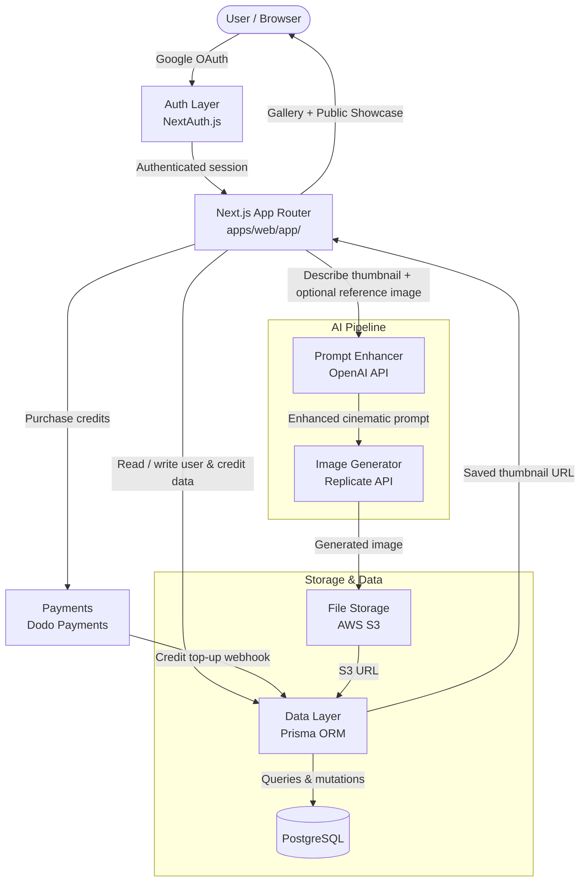

# Thumbnaily AI — Architecture

This document gives new contributors a quick mental model of how Thumbnaily AI is structured, how a thumbnail generation request flows through the system, and which files to open first.

---

## System Flow

---

## Layer Breakdown

### 1. Monorepo — Turborepo
The project is a Turborepo monorepo. All apps and shared packages live under `apps/` and `packages/` respectively. Turborepo handles build caching and task orchestration across workspaces. Run all commands from the repo root unless a task is workspace-specific.

### 2. Auth — NextAuth.js
Handles Google OAuth sign-in, session management, and route protection. On first sign-in, a new user record is created in PostgreSQL and free credits are allocated. Session data is available server-side via `getServerSession()` and client-side via `useSession()`.

### 3. App Router — `apps/web/app/`
The Next.js 14 App Router is the backbone of the platform. Pages include the generator, personal gallery, and public showcase. Server components fetch data directly from Prisma; client components handle form state and image previews. API routes under `apps/web/app/api/` orchestrate the AI pipeline and handle payment webhooks.

### 4. AI Pipeline — OpenAI + Replicate
Thumbnail generation is a two-step pipeline:
- **Prompt Enhancement** (OpenAI): The user's plain-text description is rewritten into a detailed cinematic prompt optimised for image generation — dramatic lighting, strong composition, symbolic elements.
- **Image Generation** (Replicate): The enhanced prompt (and optional reference image) is sent to a Replicate model which returns the final thumbnail image.

Both API calls are made server-side to keep keys secure.

### 5. File Storage — AWS S3
Generated images are uploaded to an S3 bucket immediately after Replicate returns them. The S3 URL is then stored in PostgreSQL alongside the thumbnail record. All image serving is done via S3 URLs — no images are stored in the database.

### 6. Data Layer — Prisma ORM + PostgreSQL (`packages/db/`)
All database interactions go through Prisma Client. The schema defines models for users, thumbnails, and credits. The Prisma package is shared across the monorepo — import it from `packages/db` rather than re-instantiating it in each app.

### 7. Payments — Dodo Payments
Handles credit purchases. Dodo Payments sends a webhook to the API when a payment succeeds; the webhook handler increments the user's credit balance in PostgreSQL. Test webhooks locally using the Dodo dashboard or a tunnel like ngrok.

### 8. UI Layer — `packages/ui/`
Shared component library built on **ShadCN UI** and **MagicUI**, styled with **TailwindCSS**. Components are published as a workspace package and imported by `apps/web`. Add new shared components here rather than in the app directly.

---

## Key Files

| File / Folder | What it does |
|---|---|
| `apps/web/app/` | All pages, layouts, and API routes |
| `apps/web/app/api/generate/` | Core thumbnail generation API route (OpenAI → Replicate → S3) |
| `apps/web/app/api/webhooks/` | Dodo Payments webhook handler |
| `packages/db/prisma/schema.prisma` | Database schema — all models defined here |
| `packages/db/index.ts` | Shared Prisma client singleton |
| `packages/ui/` | Shared ShadCN + MagicUI component library |
| `turbo.json` | Turborepo pipeline configuration |
| `.env.local` | Environment variables (never commit this) |

---

## Data Flow in Plain English

1. A user signs in with Google via NextAuth — a user record and free credits are created in PostgreSQL.
2. The user types a thumbnail description and optionally uploads a reference image.
3. The app deducts one credit and sends the description to OpenAI for prompt enhancement.
4. The enhanced prompt is forwarded to Replicate, which generates the thumbnail image.
5. The image is uploaded to AWS S3 and its URL is saved to PostgreSQL.
6. The thumbnail appears in the user's personal gallery and the public showcase feed.
7. When credits run out, the user purchases more via Dodo Payments; a webhook tops up their balance.

---

## Getting Oriented as a New Contributor

1. **Run from the repo root** — `npm install && npm run dev` starts all Turborepo workspaces together.
2. **Set up `.env.local`** with keys for NextAuth (Google), OpenAI, Replicate, AWS S3, PostgreSQL, and Dodo Payments before running anything.
3. **Run `npx prisma generate && npx prisma migrate dev`** from `packages/db/` after cloning to sync the database schema.
4. **AI pipeline changes** go in `apps/web/app/api/generate/` — both the prompt enhancement and image generation steps live there.
5. **UI changes** go in `packages/ui/` for shared components or `apps/web/app/` for page-level layout.
6. **Credit or payment logic** lives in the webhook handler at `apps/web/app/api/webhooks/`.
